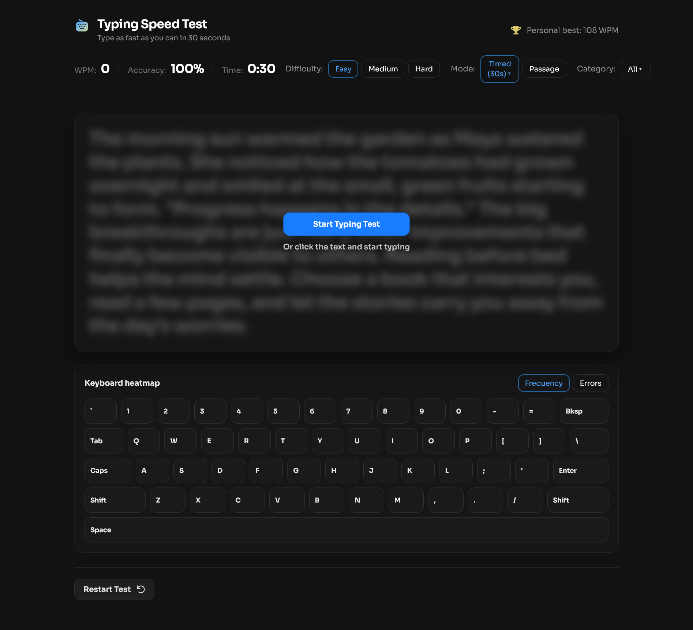
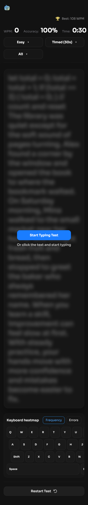

# Frontend Mentor - Typing Speed Test solution

This is a solution to the [Typing Speed Test challenge on Frontend Mentor](https://www.frontendmentor.io/challenges/typing-speed-test). Frontend Mentor challenges help you improve your coding skills by building realistic projects. 

## Table of contents

- [Overview](#overview)
  - [The challenge](#the-challenge)
  - [Screenshot](#screenshot)
  - [Links](#links)
- [My process](#my-process)
  - [Built with](#built-with)
  - [What I learned](#what-i-learned)
  - [Continued development](#continued-development)
  - [Useful resources](#useful-resources)
- [Author](#author)
- [Acknowledgments](#acknowledgments)

## Overview

A modern, responsive typing speed test built with React. Features timed and passage modes, difficulty and category filters, real-time WPM/accuracy tracking, per-key heatmap analytics, personal best persistence, and shareable result cards.

### The challenge

Problem: Most typing tests are either too basic or poorly optimized for mobile devices.
Solution: This project provides a fast, accurate, mobile-first typing improvement tool with real-time feedback, personal best tracking, and shareable results.
Impact: Helps users improve typing skills efficiently in today’s mobile-first, remote-work world.

### Screenshot




### Links

- Solution URL: [Add solution URL here](https://your-solution-url.com)
- Live Site URL: [Add live site URL here](https://your-live-site-url.com)

---


## My process

### Overview
This project was built from scratch following a structured development process that prioritized mobile-first design, real-time performance, and user experience.

### 1. Planning & Design

Analyzed Frontend Mentor requirements and identified gaps in existing typing tests
Designed feature set: multiple modes, categories, heatmap, sharing, mobile optimization
Planned component structure and data flow

### 2. Core Implementation

Built timer system with multiple duration options
Implemented real-time WPM/accuracy calculation
Created typing input handler with character-by-character diffing
Added prompt filtering system by difficulty and categories

### 3. Advanced Features

Developed keyboard heatmap with frequency/error tracking
Built PNG share card generation using Canvas API
Integrated social media sharing via web intents
Implemented personal best persistence with celebrations

### 4. Mobile Optimization

Created responsive layouts and touch-friendly controls
Developed mobile-specific keyboard heatmap layout
Fixed text wrapping and scaling for different screen sizes
Tested and refined mobile user experience

### 5. Content & Polish

Expanded prompt library with varied, meaningful passages
Added confetti animations and micro-interactions
Refined styling with focus states and hover effects
Implemented accessibility features

### 6. Testing & Iteration

Fixed runtime errors and prompt filtering bugs
Resolved personal best detection issues
Optimized performance for real-time updates
Validated cross-device compatibility

### Built with

- **React** – UI and state management
- **Vite** – Build tool and dev server
- **CSS** – Custom properties, Flexbox, CSS Grid, mobile-first
- **HTML5** – Semantic markup

### What I Learned

I picked up a lot building this—Canvas API for making those share cards without any extra libraries, got really comfortable with React state management for all the real-time stuff, and learned how tricky mobile responsiveness can be, especially for that keyboard heatmap.
Honestly, the "extra" features like the heatmap and sharing ended up being what made the project special—way more than just the basic typing test.

### Continued development

I want to explore adding more advanced analytics like keystroke timing and error pattern recognition in future iterations, as well as implementing a typing rhythm analysis feature to help users understand their typing patterns better and identify areas for improvement. I'm also interested in adding a feature to track typing speed trends over time and provide personalized improvement suggestions based on user progress 
patterns.

### Useful Resources

React Documentation – react.dev – For hooks and state management patterns
Canvas API Guide – MDN Canvas Tutorial – Helped with PNG card generation
CSS Tricks – Flexbox Guide – Essential for responsive layouts
Web.dev – Responsive Design – Mobile-first design principles
Frontend Mentor – Community Solutions – Inspiration for UI patterns and approaches
MDN Web Docs – Keyboard Events – For real-time typing tracking
CSS Variables Guide – Custom Properties – Maintained consistent theming
LocalStorage Best Practices – Web Storage API – Personal best persistence

## Features

| Feature | Details |
|---|---|
| **Modes** | Timed (15/30/60/120s) and Passage |
| **Difficulty** | Easy / Medium / Hard |
| **Categories** | All / Quotes / Lyrics / Code |
| **Real-time stats** | WPM, accuracy, time, and live character-by-character diff |
| **Personal best** | Persistent storage with “Baseline Established!” and “High Score Smashed!” celebrations |
| **Keyboard heatmap** | Frequency and error heatmaps with mobile-optimized layout |
| **Shareable results** | PNG card with WPM, accuracy, and mode |
| **Responsive design** | Mobile-first with adaptive UI and touch-friendly controls |

## Features in Detail

- **Timed Mode:** Choose 15/30/60/120s. Text length scales with duration so longer tests give you more to type.
- **Passage Mode:** Type a full passage; test ends when you finish it.
- **Live Stats:** Real-time WPM, accuracy, elapsed time, and character-by-character diff as you type.
- **Difficulty Levels:** Easy, Medium, Hard. Adjusts prompt complexity.
- **Categories:** All, Quotes, Lyrics, Code. Filter prompts by tags.
- **Personal Best:** Persistent storage. First test shows “Baseline Established!”; beating your PB shows “High Score Smashed!” with confetti.
- **Keyboard Heatmap:** After finishing, see per-key frequency and error heatmaps. On mobile, uses a compact phone-style layout.
- **Shareable Results:** Generate a PNG card with your WPM, accuracy, mode, and personal best. Share to Discord, Facebook, LinkedIn, Twitter, or copy image/download.
- **Responsive & Mobile-First:** Adaptive UI with touch-friendly controls; mobile-optimized heatmap and wrapped text.

---

## Features

| Feature | Details |
|---|---|
| **Modes** | Timed (15/30/60/120s) and Passage |
| **Difficulty** | Easy / Medium / Hard |
| **Categories** | All / Quotes / Lyrics / Code |
| **Real-time stats** | WPM, accuracy, time, and live character-by-character diff |
| **Personal best** | Persistent storage with “Baseline Established!” and “High Score Smashed!” celebrations |
| **Keyboard heatmap** | Frequency and error heatmaps with mobile-optimized layout |
| **Shareable results** | PNG card with WPM, accuracy, and mode |
| **Responsive design** | Mobile-first with adaptive UI and touch-friendly controls |

## Features in Detail

- **Timed Mode:** Choose 15/30/60/120s. Text length scales with duration so longer tests give you more to type.
- **Passage Mode:** Type a full passage; test ends when you finish it.
- **Live Stats:** Real-time WPM, accuracy, elapsed time, and character-by-character diff as you type.
- **Difficulty Levels:** Easy, Medium, Hard. Adjusts prompt complexity.
- **Categories:** All, Quotes, Lyrics, Code. Filter prompts by tags.


## Getting Started

1. Clone the repository
   ```bash
   git clone https://github.com/Frontend-Mentor-Portfolio/speedtype-project.git
   cd speedtype-project
   ```

2. Install dependencies
   ```bash
   npm install
   ```

3. Start development server
   ```bash
   npm run dev
   ```

4. Open your browser to `http://localhost:5173`

## Usage

- Choose a mode (Timed or Passage)
- Select difficulty and/or category
- Click into the text area or press Enter/Space to start typing
- View live WPM and accuracy as you type
- After finishing, see results, personal best, and share your score

## Project Structure

```
speedtype-project/
├── assets/          # Images, fonts, icons
├── src/
│   ├── data/
│   │   └── prompts.js    # Typing prompts with tags/difficulty
│   ├── utils/
│   │   └── typing.js    # WPM, accuracy, diff, PB persistence
│   ├── App.jsx          # Main app component
│   ├── App.css          # Styles (responsive, mobile-first)
│   └── main.jsx          # React entry
├── index.html
├── package.json
├── vite.config.js
└── README.md
```

## Beyond Requirements

These features were implemented beyond the core assignment requirements:

- **Multiple timed durations** (15/30/60/120s) with text scaling
- **Text categories** (Quotes, Lyrics, Code) with filtering
- **Keyboard heatmap** showing frequency and errors with mobile-optimized layout
- **Shareable result cards** (PNG) with social media integration
- **Personal best celebrations** (“Baseline Established!” and “High Score Smashed!” with confetti)
- **Responsive mobile design** including adaptive heatmap and text wrapping
- **Advanced punctuation and number prompts** for realistic typing practice

## Author

- Frontend Mentor - [@MhistaFortune](https://www.frontendmentor.io/profile/MhistaFortune)
- Twitter - [@fortunate_egwu](https://www.twitter.com/fortunate_egwu)

## Acknowledgments

## Acknowledgments

- This project is a solution to the [Typing Speed Test challenge on Frontend Mentor](https://www.frontendmentor.io/challenges/typing-speed-test)
- Prompts and content are original for this typing test.
- Icons and illustrations are custom for this project.
- Built with modern web APIs and responsive design principles.